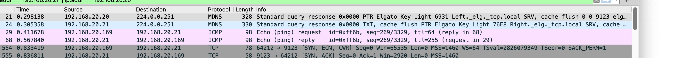
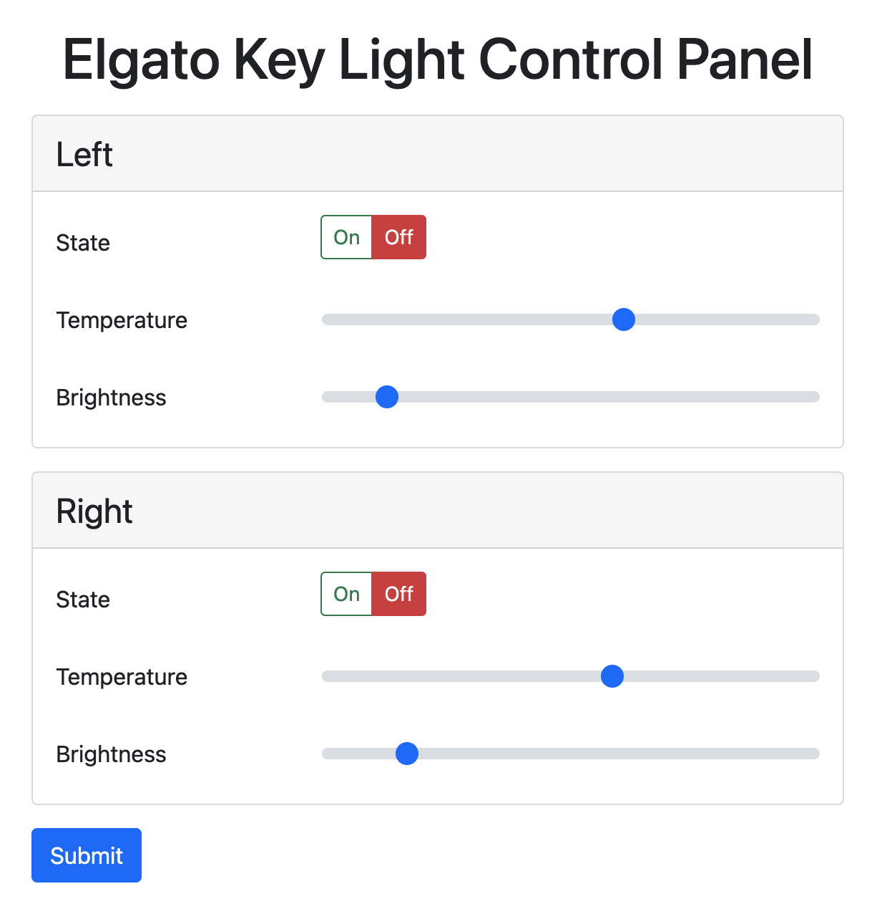

# Web-based Elgato Control Panel

## Why

The [Elgato control center software] can be used to control various Elgato products. Among others their [key lights]. Elgato's control center software needs to be installed on a desktop computer or mobile phone to function. The software does so pretty flawlessly and works nice, but it does have one restriction that encouraged the creation of this project:

**Home networks leveraging [virtual LANs] (VLANs) are not supported!** This means that it is not possible to place the Elgato lighting products into a tagged network while having the trusted desktop computers in an untagged network. [Multicast DNS] (mDNS) is the reason why it doesn't work. MDNS is used by the Elgato products to identify under which IP address the products are reachable in the local network. Unfortuantely, mDNS does not work across networks unless you establish certain mDNS forwarder/gateway technologies.



[Elgato control center software]: https://help.elgato.com/hc/en-us/sections/360004115951-Elgato-Control-Center-Software
[key lights]: https://www.elgato.com/en/key-light
[virtual LANs]: https://en.wikipedia.org/wiki/Virtual_LAN
[Multicast DNS]: https://en.wikipedia.org/wiki/Multicast_DNS

## What

This project is a small web-based app through which the Elgato lighting products can be controlled. In contrast to Elgato's own control center software, this app does not rely on mDNS. Instead, it requires configuration to know which lights are deployed in the local networks and how to reach them. This makes it less convenient than Elgato's own software, but allows it to operate in securer network configurations, e.g., when VLANs are leveraged.

The app can be run either directly as a Node.js process or deployed through Docker, e.g., on a Raspberry PI. See the following [Usage](#usage) section to learn more.



## Usage

### Configuration

This project requires the following environment variables to operate. During local development (`npm run dev`), this configuration can be specified through a `.env` file. Outside of local development environment variables need to be manually specified as shown below.

```
export PORT=8080
export LIGHTS='[
  {
    "name": "left",
    "ip": "192.168.20.20",
    "port": 9123
  },
  {
    "name": "right",
    "ip": "192.168.20.21",
    "port": 9123
  }
]'
```

### Starting Locally
```sh
# Install dependencies
npm install

# Add configuration
cp .env.sample .env
$EDITOR .env

# Start
npm run dev
```

### As Docker

#### Build the Docker Image

```sh
docker build \
  -t ecp \
  .
```

#### Running the Docker Container

```sh
docker run \
  --env 'LIGHTS=[{"name": "left", "ip": "192.168.20.20", "port": 9123},{"name": "right", "ip": "192.168.20.21", "port": 9123}]' \
  --name ecp \
  --init \
  --publish 8080:8080 \
  --memory "100M" \
  --memory-swap "100M" \
  --restart always \
  ecp
```

## Leveraged Techniques

An avid reader stumbling over the implemented techniques might be wondering why this project isn't using an SPA framework, CSS-in-JS or something other 2020+ techniques. These are my reasons:

 - The modern web technology stack comes with a slew of dependencies that constantly have security issues and breaking changes. By implementing it the way it is, I do not have to spend time frequently upgrading/maintaining these.
 - To reduce the CPU, memory and storage footpint on my Raspberry PI.
 - To make this project as small as possible (code-wise). I will only be rarely maintaining this project (hopefully). Having less code means I will have an easier time understanding what the hell I did `x` years ago 😅.
 - I have been working with web technologies since 2002 and somehow I haven't implemented a single classical server-rendered app since ~2014! I have been longing for this simplicity for quite some time. This project gave me an excuse to apply this technique again ❤️.

## License, Ownership and Trademarks

The Elgato company and project names as well as the favicon are owned by Corsair Gaming Inc. I only leverage them to help the community understand this project.

Everything else is [MIT licensed](/LICENSE).